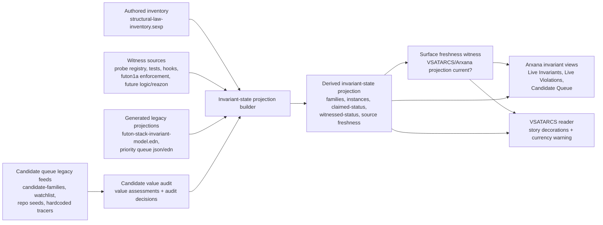

# Mission: M-vsatarcs-invariants-integration

**Date:** 2026-06-01
**Status:** INSTANTIATE (read-only INSTANTIATE-0 active; IDENTIFY opened 2026-06-01, MAP completed 2026-06-01, DERIVE accepted 2026-06-01, ARGUE accepted 2026-06-01, VERIFY accepted 2026-06-01 after count precision pass)
**Xenotype:** derivation (IDENTIFY → MAP → DERIVE → ARGUE → VERIFY → INSTANTIATE)
**Repos:** futon4 (VSATARCS reader), futon3c (invariant inventory + feeder pattern)
**Owner:** Joe frames; agent TBD. **No code until the logic model is agreed**
(per [[feedback_logic_model_before_code]] — this mission exists *because* the
invariants were built-by-assertion without a verified model).

## HEAD (Joe, 2026-06-01, verbatim sense)

Invariants are not being kept up to date, and VSATARCS **should be** (invariantly!).
Therefore: **VSATARCS takes ownership of the invariants queue**, and decorates its
stories with invariants where they exist, or **candidate** invariants where they
don't yet. In the process we **audit all candidate invariants** for whether they
are really meaningful/needed, and **ensure live invariants are actually
inspectable/testable**. Warranted because the invariants are supposed to give the
best picture of *"what the stack is"* — and right now they can't be trusted.
core.logic / reazon are core technologies we already use; building this develops a
**logic model of the stack**, complementing the **AIF model already integrated
with VSATARCS**.

## 1. IDENTIFY

### The tension (why this mission exists)

Two facts collided this session (2026-06-01):

1. **The invariant queue cannot be trusted.** The Arxana Browser → Candidate
   Queue rendered ~month-stale data, overridden by out-of-date priorities, fed
   from **four un-reconciled sources** (`candidate-families`,
   `candidate-family-watchlist`, a May-2 `stack-stereolithography-priority-queue.json`,
   and hardcoded tracer items in `arxana-browser-lab.el`). An audit of one source
   reported a different item-set than the view showed — the auditor couldn't see
   the whole queue. **Root cause: `:status :operational` is a self-asserted string
   with no binding to reality.** Nothing derives status from evidence; it is
   hand-typed and drifts the moment the stack moves. "It's built" ≠ a verified
   model of how the stack works.

2. **VSATARCS's premise is staying current** — and it has a working currency
   organ the invariants lack.

### What's actually true about VSATARCS (verified 2026-06-01, do not re-assume)

- **VSATARCS the reader is NOT a writer** (`futon4/README-vsatarcs.md`: "Not a
  writer"). It scans scene-form `*.md` and renders them. So "VSATARCS keeps itself
  up to date" is only half-true — the *reader* doesn't.
- **The currency organ is `futon3c/src/futon3c/vsatarcs/feeder.clj`** — a
  **periodic poll** (not file-watch) that: reads live substrates → derives
  candidate entries → dedups by content-hash + id → appends only novel entries to
  the canonical `.aif.edn`, marked `:auto-generated true :review-status :pending`.
  **This is the pattern the invariants lack:** a poll that keeps a canonical file
  current from live state, with auto-generated entries distinguishable from
  human-refined ones.
- VSATARCS already carries an **AIF model** overlay (`.aif.edn` per story); a
  **logic model** (core.logic/reazon) would be the complementary axis.

### The reframe (the cure, stated as a constraint)

**Status must be derived from a witness, never asserted.** An invariant entry does
not *carry* `:operational` — it carries a witness reference (a check-fn + its last
result), and `operational` is *rendered* from "witness ran ∧ held." No witness ⇒
`:candidate` **by construction**. This is the inversion the queue needs and the
thing VSATARCS's feeder pattern can mechanically enforce.

The first instance of the right shape already exists: `I-invariant-queue-freshness`
(`futon3c/src/futon3c/logic/invariant_queue_freshness.clj`, built+tested this
session) — status earned by a witness (`mtime(source) > mtime(derived)`), not typed.
It is surrounded by 100+ entries that are mere assertions.

### What the mission delivers (scope sketch — to refine in MAP/DERIVE)

1. **VSATARCS owns the invariants queue** — a feeder (sibling of
   `vsatarcs/feeder.clj`) periodically runs the witness check-fns and writes
   *derived* status to the canonical inventory; the VSATARCS reader surfaces it.
2. **Stories decorated with invariants** — where a story's subject has live
   (witnessed) invariants, decorate with them; where only candidate pressure
   exists, decorate with the candidate. The decoration is honest because it's fed
   from witnesses.
3. **Full candidate audit** — across ALL FOUR feeds (not one), reconciled: is each
   candidate meaningful/needed, or fold/drop? (The session's partial audit —
   `futon3c/holes/missions/invariant-queue-audit-2026-06-01.md` — covered only
   `candidate-families`; redo across all sources.)
4. **Live invariants made inspectable/testable** — every entry claiming
   `:operational` must have a runnable witness; those that can't be witnessed drop
   to `:candidate`. (Expect many to drop — that is the honest, painful outcome.)
5. **A logic model of the stack** (core.logic/reazon) — the witnesses as relations
   over an evidence pldb, complementing the AIF model. This is the "verified logic
   model of how the stack works" the HEAD asks for.

### Relations to existing work
- **M-invariant-queue-unstuck / -extend** (futon3c) — named the "queue = projection,
  not enumeration" reframe and the canary/coverage-ratchet ideas; this mission is
  the *VSATARCS-owned* realisation that finally enforces currency.
- **`invariant-queue-audit-2026-06-01.md`** — the partial (one-feed) audit;
  superseded by deliverable #3.
- **`I-invariant-queue-freshness`** — the first status-as-witness instance; the
  pattern to generalise.
- [[feedback_logic_model_before_code]] — the discipline this mission must follow
  (model before code; the queue's failure is that it didn't).
- VSATARCS AIF model (`futon4/docs/vsatarcs-*.aif.edn`) — the logic model
  complements it.
- `vsatarcs/feeder.clj` — the currency mechanism to port.

### IDENTIFY exit

Advanced to MAP on 2026-06-01 at Joe's request. The gap is accepted as real:
the invariant queue's claimed live status is not evidence-bound, while VSATARCS
already has a currency pattern that can keep canonical story-adjacent structure
fresh. Scope remains "model before code"; MAP is allowed to survey, count, and
read, but not to implement the feeder or demote inventory entries.

## 2. MAP

Survey target: inventory the existing invariant, probe, queue, feeder, and
VSATARCS reader surfaces well enough that DERIVE can specify a logic model
without guessing.

### MAP checklist

- [x] **Inventory existing infrastructure:** initial pass recorded below.
- [x] **Inventory existing data:** initial pass recorded below.
- [x] **Identify ready vs missing:** initial ready/missing table recorded below.
- [x] **Answer survey questions:** Q1-Q6 answered below.
- [x] **Document surprises:** scope-changing findings recorded below.

### Existing infrastructure

| Surface | Current fact | File(s) |
|---|---|---|
| VSATARCS reader | Reader only; scans scene-form `*.md`, filters `*.aif.md`, renders anthology entries. It is not a writer. | `futon4/README-vsatarcs.md`, `futon4/dev/arxana-browser-vsatarcs.el` |
| VSATARCS AIF overlay | Per-story `.aif.edn` files are the canonical machine-readable AIF overlays; prose `.aif.md` is generated. | `futon5a/holes/stories/*.aif.edn`, `futon5a/scripts/render_*.clj` |
| VSATARCS feeder pattern | Periodic poll in futon3c JVM; reads live substrates, derives entries, dedups by hash/id, appends novel `:auto-generated true :review-status :pending` entries to canonical `.aif.edn`. | `futon3c/src/futon3c/vsatarcs/feeder.clj` |
| Invariant browser menu | Arxana exposes `Live Invariants`, `Live Violations`, `Candidate Queue`, and guide views. | `futon4/dev/arxana-browser-lab.el`, `futon4/README-invariants.md` |
| Live invariant model projection | `futon4/futon-stack-invariant-model.edn` is a derived projection from `futon3c/docs/structural-law-inventory.sexp`; current mtime shows it is older than the source. | `futon4/futon-stack-invariant-model.edn` |
| Candidate queue projection | `futon5a/data/stack-stereolithography-priority-queue.{edn,json}` and Markdown report are generated by the prioritizer; current JSON is older than the inventory source. | `futon5a/scripts/prioritize_stack_stereolithography_queue.clj`, `futon5a/data/stack-stereolithography-priority-queue.json` |
| Probe registry | `futon3c.logic.probe/family-check-fns` maps family-id to check-fn; check-fns return `{:outcome :ok|:violation|:inactive :detail ...}` and probe sweeps emit evidence. | `futon3c/src/futon3c/logic/probe.clj` |
| Existing witness exemplar | `I-invariant-queue-freshness` checks source/artifact mtimes and reports stale derived queue inputs with standard probe result shape. | `futon3c/src/futon3c/logic/invariant_queue_freshness.clj`, `futon3c/test/futon3c/logic/invariant_queue_freshness_test.clj` |
| Boot-time probe registration | Some family check-fns are boot-registered from `dev/bootstrap.clj`; direct ad-hoc mutation is guarded by reachable-from-boot checks. | `futon3c/dev/futon3c/dev/bootstrap.clj`, `futon3c/src/futon3c/logic/probe.clj` |

### Existing data

| Data | Current fact |
|---|---|
| Canonical invariant inventory | `futon3c/docs/structural-law-inventory.sexp` is 1036 lines; rough status scan: 37 `operational`, 18 `operational-when-enabled`, 2 `operational-but-bypassable`, 36 `candidate`, plus one unrelated `:status carry` mention. Section extraction finds 15 operational-family forms, 12 candidate-family forms, and 47 candidate-invariant entries under `candidate-families`. These are textual claims, not all witness-derived facts. |
| Derived invariant hypergraph | `futon4/futon-stack-invariant-model.edn` is 455 lines; rough status scan: 9 `:operational`, 1 `:operational-but-bypassable`, 9 `:candidate`. It identifies `structural-law-inventory.sexp` as source-of-truth. |
| Candidate priority queue | `stack-stereolithography-priority-queue.json` is 7575 lines, mtime `2026-05-02 23:12`; `stack-stereolithography-priority-queue.edn` is 7295 lines, mtime `2026-04-27 10:05`; both are stale relative to the inventory mtime `2026-06-01 19:41`. |
| Candidate browser feeds | The Candidate Queue currently combines `candidate-family-watchlist`, `candidate-families`, repo-seeded devmap entries, generated priority JSON, and hardcoded tracer items in `arxana-browser-lab.el`. |
| Hardcoded tracer/work items | `arxana-browser--invariant-queue-tracer-items` intersperses pipeline-tracer and related work items into the Candidate Queue outside the canonical inventory. |
| Story substrate | `futon5a/holes/stories/leaf-invariants.md` and `leaf-invariants.aif.edn` already describe the invariants pillar and candidate/operational distinction, but are not currently decorated from live witness state. |

### Ready vs missing

| Ready (no new code needed) | Missing (actual work for DERIVE/INSTANTIATE) |
|---|---|
| VSATARCS scene reader and AIF sibling conventions. | A logic/invariant decoration model for stories. |
| Periodic feeder pattern with hash/id dedup and human-review marker fields. | A new invariants feeder that owns one canonical queue projection. |
| Canonical inventory file and derived queue/model artifacts. | A reconciliation plan for four current feeds into one source-of-truth path. |
| Standard probe check-fn result shape and scheduled/on-demand probe apparatus. | Minimal witness contract for every claimed-live invariant entry. |
| One freshness witness exemplar with tests. | Inventory-wide audit deciding which entries have witnesses, need witnesses, fold, or drop. |
| Arxana invariant browser surfaces. | Rendering change that distinguishes witnessed/live, candidate, inactive, and stale without asserting status. |
| Boot-time registration pattern for family check-fns. | Cadence and safety rules for a feeder/probe loop that must not OOM or require JVM restarts. |
| Existing `leaf-invariants` story and AIF overlay. | Binding rule from story/scene/entity to invariant IDs or candidate pressures. |

### MAP answers

#### Q1-source-of-truth

**Finding:** The only existing authored invariant source-of-truth is
`futon3c/docs/structural-law-inventory.sexp`. Both `futon4/futon-stack-invariant-model.edn`
and `futon5a/data/stack-stereolithography-priority-queue.{edn,json}` are derived
projections, and both are currently stale relative to the inventory. The hardcoded
tracer rows in `arxana-browser-lab.el` are browser-local work items, not a
canonical inventory.

**MAP answer for DERIVE:** Treat `structural-law-inventory.sexp` as the authored
source until DERIVE explicitly replaces it. The other feeds should not be treated
as sources of truth. DERIVE must specify a single derived witness/status projection
for VSATARCS/Arxana to read, and must fold or retire generated priority JSON and
hardcoded tracer rows as display authorities.

#### Q2-witness-shape

**Finding:** The existing live probe contract is already broad enough for browser
status: a registered check-fn returns `{:outcome :ok|:violation|:inactive :detail
...}`; the probe augments it with family-id, run-id, timestamp, counts, and evidence
emission. Missing registrations already yield `:inactive`, which is exactly the
honest "not witnessed" signal this mission needs. `I-invariant-queue-freshness`
uses this shape without a pldb. Other invariant families use core.logic/pldb-style
checks where the domain requires it.

**MAP answer for DERIVE:** Use the probe-result shape as the minimal witness
contract. Core.logic/reazon relations can be the implementation of a witness when
appropriate, but should not be required for every witness. Some future invariants
may be created directly from core.logic/reazon work and not be listed in the
current inventory yet; others may already be canonical and good while being
enforced by a different mechanism. The logic model should define how
relation-backed witnesses and non-relation witnesses both project into the same
result shape.

#### Q3-feeder-cadence-and-safety

**Finding:** Two relevant loops already exist. `vsatarcs/feeder.clj` defaults to a
single-threaded periodic poll every 60 seconds using `scheduleWithFixedDelay`.
`futon3c.logic.probe` defaults to an hourly scheduled sweep, with a documented
24-hour backoff cadence and an on-demand `probe-now!`. Safety discipline elsewhere
is explicit: no JVM restart for live changes; no synchronous heavy Drawbridge calls;
use request/fire-and-return patterns for heavy work. The scar tissue is documented
in `futon3c/src/futon3c/wm/scheduler.clj`, which warns that synchronous `tick!`
calls via Drawbridge caused timeout/OOM-style failure modes.

**MAP answer for DERIVE:** The invariants feeder must be single-threaded,
idempotent, bounded, and non-blocking from operator surfaces. It should use the
hourly probe cadence as the default baseline, not the 60-second VSATARCS feeder
cadence, unless DERIVE proves the work is cheap. Any manual trigger must enqueue
or run bounded work rather than holding a heavy Drawbridge eval open.

#### Q4-decoration-binding

**Finding:** Existing binding identifiers are:

- story slug / source path: `leaf-invariants.md`, `.aif.edn :leaf "invariants"`,
  `.aif.edn :source "futon5a/holes/stories/leaf-invariants.md"`;
- scene anchors in Markdown: `overview`, `pillar-role`, `op-graph-existence`,
  `op-mission-process`, `op-system-auth`, `cand-custody`, `cand-inspectability`,
  `cand-control`, `promotion-criterion`, `closure-evidence`,
  `structural-law-case`;
- AIF node ids and refs: `:nOp`, `:nCand`, `:nOpGE`, `:nOpMP`, `:nOpSA`,
  `:nCaCus`, `:nCaIns`, `:nCaCtl`, `:nPromote`, `:nS6`, with refs such as
  `sorry|structural-law|tier|operational`.

There is no existing explicit field that binds a story scene or AIF node directly
to invariant family IDs such as `graph-symmetry` or `atomic-inspectable-units`.

**MAP answer for DERIVE:** Existing slugs, scene anchors, AIF node ids, and AIF
refs are sufficient anchors for an explicit decoration map. They are not sufficient
as an implicit binding rule. DERIVE must add or specify an explicit map from
story/scene/AIF node to invariant family/invariant IDs.

#### Q5-logic-vs-AIF

**Finding:** VSATARCS AIF overlays are story-argument structure: `.aif.edn` is the
canonical machine-readable overlay and `.aif.md` is generated prose. The probe
apparatus is operational evidence: check-fns run against files, live state, or pldb
snapshots and emit witness outcomes. Current AIF nodes in `leaf-invariants.aif.edn`
state claims such as "9 operational families" and "10 candidate families", but
those counts are now stale relative to `structural-law-inventory.sexp`.

**MAP answer for DERIVE:** Logic witnesses and AIF overlays are sibling axes over
the same story substrate. AIF should not be the source of witness truth; it should
refer to, summarize, or render witness-derived state. DERIVE must specify how the
logic projection decorates AIF/story nodes without making the AIF overlay carry
freshness responsibility by assertion.

#### Q6-honest-demotion

**Finding:** The inventory currently uses one field, `:status`, for authored
claims. The probe apparatus already distinguishes `:ok`, `:violation`, and
`:inactive`, and can report inactive when no check is registered. Existing
browser code already treats statuses such as `operational-when-enabled` and
`operational-but-bypassable` as different lanes, so it can display a more nuanced
status if DERIVE supplies one. Absence from the probe registry is not proof that
an invariant is bad or non-canonical: futon1a's invariants remain canonical and
trusted even if their enforcement mechanism is not represented in the current
futon3c probe apparatus. Rewriting all asserted statuses in-place during MAP would
corrupt history and violate the no-code/no-migration-before-model constraint.

**MAP answer for DERIVE:** Use a staged migration with dual status semantics:
preserve authored/claimed status, add derived witnessed status, and render
operationality from the witnessed status. Entries with no witness become
`witnessed-status :inactive` or equivalent in the derived projection, not silently
rewritten in the authored inventory. A later migration can decide whether to
change authored statuses after the audit is complete.

### MAP surprises

1. **The story counts are stale.** `leaf-invariants.md` and
   `leaf-invariants.aif.edn` still describe "9 operational + 10 candidate"
   families. The current inventory scan finds 15 operational-family forms and 12
   candidate-family forms. This is a direct instance of the mission's problem:
   story/AIF claims about invariant state can drift from the inventory.

2. **The source projection is older than the source.** The inventory mtime is
   `2026-06-01 19:41`; `futon-stack-invariant-model.edn` is `2026-04-30 15:55`;
   priority queue JSON is `2026-05-02 23:12`; priority queue EDN is
   `2026-04-27 10:05`. The freshness witness has a real current violation to
   report.

3. **The browser queue has more than four effective feeds.** Besides
   `candidate-family-watchlist`, `candidate-families`, priority JSON, and
   hardcoded tracer items, the browser also tries to flatten repo-seeded devmap
   candidate entries from `repo-seeds`.

4. **Repo-seed parsing may be structurally suspect.** A read using the same
   first-section extraction shape as `arxana-browser-lab.el` sees only two
   `repo-seeds` devmaps, while text search shows later `devmap :id` forms for
   futon3, futon3c, futon4, futon5, and futon6. DERIVE should not depend on
   repo-seed coverage until this is checked.

5. **The minimal witness shape already exists.** The missing piece is not a new
   result vocabulary; it is inventory-wide registration, ownership, and projection
   discipline.

6. **The inventory is not the universe of invariants.** Core.logic/reazon work may
   create additional invariants not yet listed here, and some existing canonical
   invariants may be enforced outside the probed futon3c shape. DERIVE must avoid
   equating "not currently listed/probed" with "not real."

### MAP exit

MAP is complete as of 2026-06-01. Every MAP question has a concrete answer, and
the ready/missing table is sufficient for DERIVE. The next phase must design the
logic model and projection contract before any code or migration.

## 3. DERIVE

**Status:** accepted for ARGUE 2026-06-01. No implementation, migration, or
demotion happens in DERIVE.

### DERIVE checklist

- [x] **Entity types:** proposed below.
- [x] **Relation types:** proposed below.
- [x] **Invariant rules:** proposed below.
- [x] **Data flow:** proposed below.
- [x] **IF/HOWEVER/THEN/BECAUSE:** recorded for the non-obvious decisions.
- [x] **View/UI specifications:** proposed below.
- [x] **Wiring diagram:** deferred to VERIFY as an explicit carry-forward because
  this mission crosses futon3c, futon4, and futon5a.
- [x] **Fidelity contract:** draft matrix recorded below; convert to tripwire
  tests before implementation.

### Design principle

The authored inventory may say what the stack believes about an invariant. The
derived projection says what the stack can currently witness. UI status must be
rendered from the derived projection, not from the authored claim alone.

The load-bearing example is also a real invariant target for this mission:
**VSATARCS should invariantly be kept up to date.** That means the VSATARCS-facing
projection must itself have a freshness witness. If VSATARCS is the reader surface
that explains the stack, stale invariant decorations are not merely stale docs;
they are a violation of the mission's premise.

### Entity types

| Entity | Identity | Source | Notes |
|---|---|---|---|
| `invariant-family` | family id, e.g. `status-discipline`, `archaeology-control` | authored inventory | Grouping/arena. May contain operational, candidate, or mixed invariants. |
| `invariant-instance` | namespaced invariant id, e.g. `obsolescence-recognition/autostash` | authored inventory, future logic work | The concrete thing that can be witnessed, audited, promoted, folded, or dropped. |
| `witness` | stable witness id, preferably `<invariant-id>#<witness-kind>` | authored or generated registry | Declares how an invariant is checked. May wrap core.logic/reazon, file checks, tests, hooks, or external canonical mechanisms. |
| `witness-run` | run id + witness id + timestamp | derived runtime evidence | A concrete result: `:ok`, `:violation`, `:inactive`, or `:error` with detail. |
| `claimed-status` | invariant id + authored status | authored inventory | Preserved for history and intent. Never treated as operational proof by itself. |
| `witnessed-status` | invariant id + latest eligible witness result | derived projection | The status rendered by VSATARCS/Arxana for "what is currently known." |
| `queue-entry` | invariant id + lane/source | derived projection | Candidate/promote/work item as displayed in Arxana and VSATARCS. |
| `story-decoration` | story id + scene/node anchor + invariant id | authored or derived map | Binds VSATARCS story material to invariant state. |
| `surface-freshness-witness` | surface id + source/projection pair | derived/runtime | Witness that a reader-facing projection, especially VSATARCS, is current relative to its source state. |
| `candidate-value-assessment` | queue-entry id + assessment timestamp | authored/derived during audit | Judgment of whether an existing candidate has invariant value, work-item value, duplicate value, or no remaining value. |
| `audit-decision` | invariant id + decision timestamp | authored after audit | `keep`, `needs-witness`, `fold-into`, `convert-to-work-item`, `drop`, `promote`, `defer`, with rationale. |

### Relation types

| Relation | Meaning |
|---|---|
| `family contains invariant-instance` | An instance belongs under a family/protocol shape. |
| `invariant-instance has claimed-status` | Authored maturity claim from the inventory. |
| `invariant-instance has witness` | A checkable mechanism exists, whether probe-backed, test-backed, hook-backed, or otherwise. |
| `witness produced witness-run` | Runtime/history relation from a witness to an observed result. |
| `witness-run derives witnessed-status` | Latest eligible run determines rendered status. |
| `story-decoration decorates story-anchor with invariant-instance` | VSATARCS binding from story/scene/AIF node to invariant state. |
| `surface-freshness-witness covers surface projection` | The reader-facing projection has an explicit currency check. |
| `queue-entry sourced-from inventory/projection/tracer/audit` | Provenance relation needed to retire multi-feed ambiguity. |
| `candidate-value-assessment evaluates queue-entry` | The audit records why a candidate has value or should be folded/dropped. |
| `audit-decision supersedes queue-entry` | Candidate audit can fold/drop/promote/defer an entry without deleting history. |

### Witness contract

Minimal witness result:

```clojure
{:witness/id ...
 :invariant/id ...
 :family/id ...
 :outcome :ok|:violation|:inactive|:error
 :detail {...}
 :checked-at "ISO-8601"
 :source {...}}
```

Projection rule:

```clojure
(claimed-status invariant)      ;; authored intent/history
(latest-witness-run invariant)  ;; derived fact
(witnessed-status invariant)    ;; rendered status
```

Rendered operationality:

| Condition | Rendered witnessed status |
|---|---|
| latest eligible witness outcome is `:ok` | `:witnessed/ok` |
| latest eligible witness outcome is `:violation` | `:witnessed/violation` |
| witness exists but is disabled/deferred/not recently run | `:witnessed/inactive` |
| witness threw or returned malformed data | `:witnessed/error` |
| no witness is known | `:witnessed/missing` |

Do not collapse `:witnessed/missing` into `:candidate` during DERIVE. Some
canonical invariants, especially futon1a invariants, may be enforced by mechanisms
this mission has not yet modeled. Missing witness means "not represented in this
projection yet", not "not real."

### Invariant rules

1. **No asserted operationality:** UI must not render an invariant as live merely
   because authored `:status` says `operational`.
2. **Claim/evidence split:** every displayed invariant carries both authored
   `claimed-status` and derived `witnessed-status`.
3. **No silent demotion:** missing witness never rewrites the authored inventory.
   It produces a derived `:witnessed/missing` state and an audit obligation.
4. **Witness plurality:** a valid witness may be a probe check-fn, a core.logic or
   reazon relation, a test/hook/static check, or a documented canonical enforcement
   path. The projection must record witness kind.
5. **Freshness first:** generated queue/model projections must carry source mtime
   or source hash; stale projections render as stale before their contents are
   trusted.
6. **VSATARCS currency invariant:** VSATARCS-facing invariant decorations must be
   freshness-witnessed against their source inventory/projection. If the source is
   newer than the displayed projection, VSATARCS renders a currency violation
   before rendering the stale invariant claims.
7. **One display projection:** VSATARCS and Arxana must read one derived
   invariant-state projection rather than reconstructing queue state from multiple
   independent feeds.
8. **Decoration is explicit:** story decorations must come from an explicit
   story/scene/AIF-node to invariant-id map, not fuzzy text matching.
9. **Candidate queue value audit:** every existing Candidate Queue item must be
   assessed for value before it is preserved in the new projection. The audit must
   distinguish invariant pressure from ordinary work items, stale tracers,
   duplicates, and obsolete/no-value entries.

### Data flow

1. Read authored inventory from `futon3c/docs/structural-law-inventory.sexp`.
2. Read witness registry/projection sources:
   - futon3c probe registry and latest `:family-fired` evidence;
   - known canonical enforcement paths from inventory fields such as
     `:implemented-in`, `:enforced-at`, and `:evidenced-by`;
   - future core.logic/reazon witness declarations;
   - freshness checks for generated artifacts.
3. Build a derived invariant-state projection containing families, instances,
   claimed statuses, witness declarations, latest witness runs, witnessed statuses,
   queue lanes, and source freshness.
4. Write the projection to one canonical machine-readable artifact for consumers.
   DERIVE preference: a new generated `.edn` projection beside the existing
   inventory or in futon4 docs, not an in-place rewrite of the authored `.sexp`.
5. Run or read the surface freshness witness for the VSATARCS-facing projection:
   source inventory/projection timestamp/hash must be no newer than the rendered
   decoration/projection artifact.
6. VSATARCS/Arxana read that projection for Live Invariants, Candidate Queue, and
   story decorations.
7. Candidate audit writes explicit `audit-decision` entries; future feeder passes
   incorporate them without losing provenance.

### Candidate Queue processing protocol

DERIVE must not only define the future projection; it must process the existing
Candidate Queue and decide whether each current item has any value.

Processing steps:

1. **Assemble all current queue inputs:** `candidate-families`,
   `candidate-family-watchlist`, repo-seeded devmap candidates, generated priority
   queue entries, and hardcoded tracer/work rows.
2. **Normalize identity:** assign each row a stable candidate id, source, family,
   invariant id if present, lane, and provenance. Preserve duplicates long enough
   to diagnose why they duplicated.
3. **Classify queue-entry kind:**
   - invariant candidate: a possible structural law;
   - witness gap: a claimed-live invariant needing a witness;
   - work tracer: useful task pressure but not itself an invariant;
   - duplicate/fold candidate: same pressure as another entry;
   - stale/obsolete entry: no longer describes live pressure;
   - malformed/unowned entry: cannot be evaluated without repair.
4. **Assess value:** each entry receives a `candidate-value-assessment`:
   `:valuable`, `:valuable-after-fold`, `:work-item-not-invariant`,
   `:needs-more-evidence`, `:obsolete`, or `:drop`.
5. **Apply value criteria:**
   - Does it name a recurring structural pressure rather than a one-off task?
   - Is the pressure distinct from an already named family/instance?
   - Could a witness plausibly be written or identified?
   - Would violation matter to the stack's actual operation?
   - Is there source evidence, an owner, and a surface where it would bite?
   - Is it current, or has it been superseded by later code/work?
   - Does it identify actionable pressure in the `M-aif2` sense: something a
     downstream proposer could use to rank where intervention should happen,
     rather than a merely interesting description?
6. **Record audit decision:** keep, needs-witness, fold-into, convert-to-work-item,
   promote, defer, or drop. Dropping means "no current queue value", not deletion
   from history.
7. **Project only audited entries:** the new Candidate Queue reads from audited
   projection entries. Unaudited legacy entries may appear in an "unaudited" lane
   during migration, but must not masquerade as prioritized invariant pressure.

Output shape for an assessment:

```clojure
{:candidate/id ...
 :source ...
 :family/id ...
 :invariant/id ...
 :entry/kind :invariant-candidate|:witness-gap|:work-tracer|:duplicate|:stale|:malformed
 :value :valuable|:valuable-after-fold|:work-item-not-invariant|:needs-more-evidence|:obsolete|:drop
 :decision :keep|:needs-witness|:fold-into|:convert-to-work-item|:promote|:defer|:drop
 :decision/rationale ...
 :supersedes [...]
 :folds-into ...
 :assessed-at "ISO-8601"}
```

### IF/HOWEVER/THEN/BECAUSE decisions

**D1: Authored inventory vs derived projection**

IF `structural-law-inventory.sexp` is the only current authored source of truth,
HOWEVER its `:status` fields are not all witness-derived, THEN keep it as authored
input and create a separate derived projection, BECAUSE rewriting the source would
mix human intent/history with runtime facts and make demotion destructive.

**D2: Probe shape as projection boundary**

IF the existing probe result shape already represents `:ok`, `:violation`, and
`:inactive`, HOWEVER not every invariant should be forced into a futon3c probe
check-fn, THEN use the probe result vocabulary as the projection boundary rather
than the implementation boundary, BECAUSE core.logic/reazon, tests, hooks, and
canonical futon1a enforcement can all project to that shared result shape.

**D3: No automatic demotion**

IF many entries claiming operational status may have no modeled witness, HOWEVER
some may still be genuinely canonical through enforcement this mission has not
surveyed deeply, THEN represent missing modeled witness as `:witnessed/missing`,
BECAUSE demotion before audit would replace one false certainty with another.

**D4: Explicit story binding**

IF VSATARCS stories have scene anchors and AIF node ids, HOWEVER they do not carry
invariant ids today, THEN introduce an explicit decoration map, BECAUSE fuzzy
matching would reproduce the same drift-prone assertion pattern this mission is
trying to remove.

**D5: Cadence**

IF the existing VSATARCS feeder polls every 60 seconds, HOWEVER invariant checks
may traverse broader stack state and generated artifacts, THEN default the
invariant projection to the hourly probe cadence with backoff, BECAUSE freshness
must not create a new live-system stability risk.

**D6: VSATARCS currency as invariant**

IF the HEAD says VSATARCS should invariantly stay up to date, HOWEVER VSATARCS is
a reader and not the writer/feeder itself, THEN the feeder/projection must expose
a freshness witness that VSATARCS renders, BECAUSE otherwise the mission would
make VSATARCS a better-looking stale surface rather than a trustworthy current one.

**D7: Audit before preservation**

IF the current Candidate Queue contains mixed entries from multiple feeds,
HOWEVER some entries may still carry real invariant pressure while others are
duplicates, stale tracers, or ordinary work items, THEN every legacy queue row must
receive a value assessment before being preserved in the new projection, BECAUSE
otherwise the mission would simply make the existing noisy queue more durable.

### View/UI specification

**Live Invariants / family detail**

- Show family/invariant id, authored claimed status, witnessed status, witness
  kind, last checked time, outcome, and source freshness.
- Use distinct labels for `claimed operational` and `witnessed ok`; never merge
  them into one "operational" label.
- For `:witnessed/missing`, show "No modeled witness" and route to audit, not to
  failure panic.
- For `:witnessed/violation` or stale source projection, make the stale/violating
  witness the first visible fact.

**Candidate Queue**

- Queue rows come from the derived projection, not from JSON + inventory +
  hardcoded tracers assembled at render time.
- Each row shows provenance: inventory candidate, repo seed, tracer/work item,
  audit decision, or witness gap.
- Each row shows value assessment and audit decision. Rows that are useful work
  items but not invariants must be labeled as such or moved out of the invariant
  queue.
- Hardcoded tracer items must either become projection entries or disappear from
  the canonical queue surface.

**VSATARCS story decoration**

- Story scenes display a compact invariant strip only when the explicit decoration
  map binds that story/scene/AIF node to invariant ids.
- Before showing invariant decorations, VSATARCS checks/render-reads the freshness
  state for the decoration projection. If stale, the stale/currency violation is
  displayed ahead of the decoration content.
- Decoration groups by witnessed status: witnessed ok, violation, inactive,
  missing witness, candidate pressure.
- Candidate pressure is allowed, but must be named as candidate/audit pressure,
  not live invariant state.

### Fidelity contract draft

Before implementation, preserve these existing capabilities:

| Capability | Preserve/adapt/drop | Note |
|---|---|---|
| Existing Live Invariants view opens and lists families | preserve | Source changes to derived projection, but capability remains. |
| Existing Live Violations view surfaces concrete violations | preserve | May later enrich with witness-run details. |
| Candidate Queue remains browsable by lane/priority | adapt | Priority must come from canonical projection/provenance, not stale JSON alone. |
| VSATARCS remains a reader, not a writer | preserve | Feeder/projection writes are futon3c-side. |
| AIF `.edn` remains story argument overlay | preserve | Witness state decorates; it does not become AIF source truth. |
| Hardcoded tracer rows in browser code | drop/adapt | Must become projection data if still needed. |

### DERIVE carry-forward

- Decide projection artifact path/name.
- Decide exact schema for witness declarations and witness runs.
- Decide whether candidate value assessments live in the same projection artifact
  as witness state or in a separate audit log consumed by the projection builder.
- Add wiring diagram showing authored inventory, witness sources, projection
  builder, Arxana views, and VSATARCS story decoration.
- Convert fidelity contract draft into tripwire tests before implementation.
- Check repo-seed parse structure before relying on repo-seeded candidate rows.

### DERIVE exit

DERIVE is accepted for ARGUE as of 2026-06-01. The design is implementable in
outline: a derived invariant-state projection separates authored claims from
witnessed status, uses a plural witness contract, treats VSATARCS currency as an
invariant, and audits existing Candidate Queue rows for value before preserving
them.

## 4. ARGUE

**Status:** draft opened 2026-06-01. ARGUE is not complete until Joe agrees the
design is the right one, not merely workable.

### ARGUE checklist

- [x] **Pattern cross-reference:** recorded below.
- [x] **Theoretical coherence:** recorded below.
- [x] **Trade-off summary:** recorded below.
- [x] **Generalization notes:** recorded below.
- [x] **Plain-language argument:** recorded below.

### Pattern cross-reference

| Pattern | Where it applies | How it shapes the design |
|---|---|---|
| `agent/evidence-over-assertion.flexiarg` | claimed status vs witnessed status | The mission's central rule is that `:operational` cannot be trusted as an assertion. Every displayed live claim needs evidence or a provisional/missing-witness state. |
| `system-coherence/turn-design-into-checks.flexiarg` | witness contract and VSATARCS currency invariant | The design turns "VSATARCS should stay up to date" from a slogan into a freshness witness and display rule. |
| `stack-coherence/staleness-scan.flexiarg` + `library-coherence/library-staleness-scan.flexiarg` | source/projection freshness | Generated invariant views must compare source timestamps/hashes to projection timestamps/hashes before rendering stale claims as current. |
| `sidecar/proposal-ledger-for-fuzzy-output.flexiarg` | Candidate Queue value audit | Candidate rows are proposals with provenance, not facts. They must be reviewed before preservation. |
| `sidecar/explicit-promotion-to-facts.flexiarg` | candidate -> operational promotion | Promotion requires explicit logged action and validation, not side-effect or Joe-memory. |
| `sidecar/fact-lifecycle-event-types.flexiarg` | claimed/witnessed status and audit decisions | Current status is derived from lifecycle events/results rather than overwritten in place. |
| `sidecar/append-only-semantic-audit.flexiarg` | audit-decision and candidate-value-assessment | Fold/drop/promote decisions preserve history instead of silently mutating or deleting candidate pressure. |
| `vsatelier/projection-independence.flexiarg` | Arxana + VSATARCS readers | The invariant-state projection is renderer-independent; Arxana tables and VSATARCS story strips consume the same contract. |
| `futon-theory/single-source-of-truth.flexiarg` | authored inventory and derived projection | The design prevents identity/source ambiguity by distinguishing one authored inventory from one derived display projection. |
| `war-machine/operational-not-decorative.flexiarg` | reader surfaces and AIF overlay | VSATARCS/AIF decoration is operational only if failures change rendered behavior; otherwise it is decorative documentation. |

### Theoretical coherence

The IDENTIFY claim was that status must be derived from a witness, never asserted.
The DERIVE design preserves that claim by splitting `claimed-status` from
`witnessed-status` and requiring every reader surface to show the difference.
This is coherent with AIF framing: operational invariants are high-precision
claims only when a witness makes violation observable; candidate invariants remain
lower-precision pressures until they earn witnesses or are dropped/folded.

The design also respects VSATARCS's actual nature. VSATARCS is a reader, not a
writer, so the currency mechanism cannot be "VSATARCS edits itself." The coherent
move is to make futon3c own the feeder/projection and make VSATARCS render the
projection's freshness state. That satisfies the HEAD without pretending the
reader has write authority.

Finally, the design does not overfit to core.logic/reazon. Those can produce
excellent witnesses, and may create new invariants, but canonical invariants can
also be enforced by tests, hooks, write gates, startup contracts, or futon1a
mechanisms. The shared contract is not "everything is core.logic"; it is "every
displayed live claim has a checkable witness path."

### Trade-offs

| Trade-off | Cost | Why accepted |
|---|---|---|
| Dual status (`claimed` + `witnessed`) instead of one status field | More schema and UI complexity | It prevents destructive demotion and preserves authored history while exposing current evidence. |
| Derived projection instead of rewriting the inventory | Another artifact to keep fresh | The projection can be freshness-witnessed; rewriting the authored inventory would blur fact, history, and current runtime evidence. |
| Explicit decoration map instead of fuzzy binding | More authoring/audit work | Fuzzy matching would reintroduce uncheckable assertion and drift. |
| Audit every Candidate Queue row before preservation | Slower migration | The current queue is noisy; preserving it wholesale would make noise durable. |
| Hourly/backoff cadence instead of aggressive polling | Less instant freshness | It avoids making the invariant system itself a stability risk. |
| Treat missing witness as `missing`, not `candidate` | Leaves ambiguity visible | Some canonical invariants are real but not yet modeled by this projection. Ambiguity is safer than false demotion. |

### Generalization notes

This design generalizes to any stack surface where authored claims drift from
runtime truth: stories, AIF overlays, docbooks, dashboards, generated queues, and
pattern libraries. The reusable shape is:

1. preserve authored claims;
2. derive witnessed state separately;
3. freshness-check the projection;
4. render claim/evidence gaps explicitly;
5. audit legacy candidates before making them durable.

The design is especially portable to VSATARCS-like readers because it treats
projection as an independent contract. A web table, Emacs buffer, story strip, or
future spatial interface can render the same invariant-state projection without
becoming the source of truth.

### Plain-language argument

The current invariant queue is untrustworthy because it mixes what we once claimed
with what the system can actually prove now. The fix is to keep the old claims,
but render live status only from witnesses: checks, tests, hooks, or other
canonical enforcement paths. VSATARCS should show invariant state only through a
fresh projection, and it should say loudly when that projection is stale. The
Candidate Queue also needs judgment: each existing item should be kept, folded,
converted to ordinary work, or dropped based on whether it still has real
invariant value.

### ARGUE exit status

ARGUE accepted for VERIFY on 2026-06-01. VERIFY begins with a wiring diagram and
a pre-code tripwire matrix for the existing Live Invariants, Live Violations,
Candidate Queue, and VSATARCS reader capabilities.

## 5. VERIFY

**Status:** conditional 2026-06-01 after Claude review. No write implementation
until the read-only feed-enumeration spike pins the canonical candidate count and
proves the multi-feed read.

### VERIFY checklist

- [x] **Structural verification:** wiring diagram and checks recorded below.
- [x] **Prototype / spike:** Claude review flags a required read-only
  feed-enumeration spike before write implementation; count strata and current
  row denominator recorded below.
- [x] **Completion criteria pre-check:** recorded below.
- [x] **Fidelity check:** tripwire matrix recorded below.
- [x] **Decision log:** recorded below.

### Claude review conditions (2026-06-01)

Claude's VERIFY review accepted the design direction but rejected the overly clean
verification pass as insufficiently adversarial. Two conditions are now recorded
before write implementation:

1. **The 100% structural pass is a yellow flag.** The design needs at least one
   adversarial pre-code check. The cheapest one is a read-only spike that
   enumerates all legacy feeds and attempts to produce one coherent candidate
   denominator.
2. **The candidate count is unresolved and load-bearing.** Codex MAP counted 12
   families / 47 invariants under one section extraction; Claude's recount reads
   21 / 91 under a different slice. This is not a trivia discrepancy: "audit all
   candidates" has no agreed denominator until the parser and boundaries are
   fixed.

Result: VERIFY can proceed only as **conditional**. INSTANTIATE must begin with
`INSTANTIATE-0`, a read-only feed-enumeration spike. No schema writes, queue
migration, browser rewrite, or status demotion may happen before that spike pins
the canonical enumeration.

### Core.logic VERIFY precedent

Recent missions used core.logic as a substantive VERIFY layer, not just a prose
check. Examples found in the local mission corpus:

- `M-portfolio-inference` used a core.logic relational layer to compute the
  structurally valid candidate set before AIF scoring.
- `M-three-column-stack` specified cross-column invariants with core.logic
  signatures and later verified round-trip/invariant behavior.
- `M-mission-peripheral` used backward verification relations over the mission
  evidence model.

This mission should inherit that discipline where it helps. The read-only
feed-enumeration spike can be plain EDN/Elisp/Clojure parsing at first, but VERIFY
should prefer a small relational check if the ambiguity is structural: e.g. a
relation that says each candidate row has exactly one normalized identity, one
source class, and one audit denominator membership.

Going forward, this is stronger than a local implementation preference: missions
that make structural claims should have an explicit lift into a logic model when
the claim can be usefully checked there. Older missions may be reconstructed into
logic models selectively, but not by default. Select for missions whose outputs are
still live, whose claimed invariants affect current behavior, or whose queue rows
would otherwise remain un-auditable assertions.

This does not mean every Invariant Queue item is worth building. The queue may
contain real structural pressure, but it also contains stale projections, work
tracers, duplicate names, and candidate pressure that may be better handled by a
different mission. Value criteria may later borrow from `M-aif2`-style tension
selection, especially whether a row identifies actionable structural pressure
rather than merely an interesting description. Before that judgment can be fair,
the denominator must be reproducible.

### Count precision pass (read-only, 2026-06-01)

Initial read-only enumeration confirms that "the candidate count" is not one
number until the parser boundary is stated.

| Denominator | Count | Meaning |
|---|---:|---|
| Whole-file readable top-level forms | 10 | The inventory reads as one rooted `structural-law-inventory` form plus nine later top-level forms. |
| Whole-file invariant forms | 99 | Recursive count across all readable forms, including orphan top-level devmaps and non-candidate discovered/operational entries. |
| Whole-file family forms | 36 | Recursive count across all readable forms. |
| Whole-file devmap forms | 8 | Recursive count across all readable forms. |
| Rooted `candidate-families` families | 12 | The stable authored candidate-family section count. |
| Rooted `candidate-families` candidate invariants | 47 | The stable authored candidate-invariant count under that section. |
| Rooted `repo-seeds` devmaps | 3 | Only `futon0`, `futon1a`, and `futon3b` are inside the rooted inventory form. |
| Rooted `repo-seeds` candidate invariants | 6 | Candidate repo-seed rows visible to a strict rooted parser. |
| Rooted `repo-seeds` discovered invariants | 14 | Discovered repo-seed rows visible to a strict rooted parser. |
| Orphan top-level devmaps | 5 | `futon3`, `futon3c`, `futon4`, `futon5`, `futon6` are readable but outside the rooted inventory form. |
| Orphan top-level devmap candidate invariants | 19 | Recoverable candidate rows outside the rooted inventory. |
| Orphan top-level devmap discovered invariants | 5 | Recoverable discovered rows outside the rooted inventory. |
| Orphan top-level devmap gates | 3 | Recoverable gate rows outside the rooted inventory. |
| Arxana all-forms watchlist families | 9 | `candidate-family-watchlist` entries are family metadata/pressure headers, not invariant rows. |
| Arxana all-forms regular queue rows | 72 | Current browser logic reads all top-level forms: 47 candidate-family invariant rows + 25 repo-seed candidate rows. |
| Browser-local tracer rows | 14 | Hardcoded `arxana-browser--invariant-queue-tracer-items`; 2 pipeline tracers + 12 deferred stubs. |
| Current browser item rows before section headers | 86 | 72 regular rows + 14 tracer rows. This is the current Candidate Queue row-audit denominator. |
| Priority queue JSON runs | 68 | Stale generated ordering overlay, not a queue source of truth. |
| Priority queue EDN runs | 67 | The sibling EDN disagrees with JSON; JSON has one extra `operator-promotion-2026-05-02` run. |

By status across the whole readable file: 26 `operational`, 11
`operational-when-enabled`, 1 `operational-but-bypassable`, 24 `candidate`, and
37 with no direct invariant-level status. These are inventory claims, not
witness-derived statuses.

Provisional conclusion: `12 / 47` is valid only for the authored
`candidate-families` section. It is not valid for "full Candidate Queue audit."
The broader full-audit denominator must include repo-seed candidates and
browser/priority/tracer rows, but only after each row has a normalized identity
and class. The apparent `21 / 91` recount is a warning signal rather than a
canonical count until its slicing rule is written down.

The current valid count split is therefore:

- **Authored candidate-family audit:** 47 invariant rows under 12 families.
- **Inventory-derived invariant candidate audit:** 72 rows: 47 authored
  candidate-family rows plus 25 repo-seed candidate rows recovered by the
  browser's all-forms parser.
- **Current Candidate Queue row audit:** 86 rows: the 72 inventory-derived rows
  plus 14 browser-local tracer rows.
- **Watchlist family metadata:** 9 family rows; useful for prioritization and
  exemplar evidence, but not invariant rows.
- **Priority overlay:** JSON has 68 runs and EDN has 67; neither is the
  denominator because both are stale generated overlays.

Priority overlay join check: of the 72 inventory-derived browser rows, 62 have a
matching JSON priority key. Ten current rows lack JSON priority:
`bounded-disposition/branch`, `bounded-disposition/mission-doc`,
`bounded-disposition/stash`, `obsolescence-recognition/autostash`,
`obsolescence-recognition/deferred-stub`,
`obsolescence-recognition/pipeline-tracer`, `single-locus/agent-routing`,
`single-locus/artifact-live-copy`, `single-locus/mission-home`, and
`metabolic-balance/working-tree`. Six JSON priority rows do not correspond to
current display rows: `obsolescence-recognition`, `recover-or-drop`,
`stash-debt-bounded`, `home-repo`, `single-live-copy`, and the operator-promotion
`commit-as-you-go/working-tree-commit-pressure`.

Valid count rule for `INSTANTIATE-0`: report separate strata first, then derive
one audit denominator. Do not add unlike things into one number without labels.
The full audit denominator should be "normalized current queue pressures" rather
than "all invariant forms"; discovered operational invariants, watchlist family
headers, gates, and work tracers must be counted separately unless the audit rule
explicitly admits them.

### Wiring diagram



### Structural verification

| Check | Result | Notes |
|---|---|---|
| Completeness | conditional | All MAP inputs have a proposed route, but the legacy feed enumeration is not yet proven. |
| No orphan inputs | conditional | Repo-seed parse uncertainty and candidate-count discrepancy require the read-only spike. |
| Type safety | pass for design | Entity types cover families, instances, witnesses, witness runs, statuses, queue entries, decorations, freshness witnesses, and audit decisions. Exact EDN schema still must be fixed before code. |
| Spec coverage | partial | DERIVE supplies shapes; implementation must codify specs for witness result, projection artifact, candidate assessment, and decoration map. |
| Timescale ordering | pass | Authored inventory precedes derived projection; witnesses precede witnessed status; freshness witness runs before render; audit precedes durable queue preservation. |
| Exogeneity | pass | VSATARCS remains a reader; futon3c feeder/projection owns writes. AIF overlay remains story structure, not witness truth. |
| Compositional closure | pass | Arxana and VSATARCS both consume the same projection contract; neither reconstructs state from multiple feeds. |
| Failure visibility | pass | Stale source/projection, missing witness, witness violation, malformed witness, and unaudited candidate rows all have visible statuses. |

### Adversarial check required before write implementation

`INSTANTIATE-0: read-only feed-enumeration spike`

Purpose: prove the riskiest part of the design before any write path exists:
reading all legacy candidate feeds and producing one coherent candidate
denominator.

Inputs to enumerate:

- `candidate-families` from `structural-law-inventory.sexp`;
- `candidate-family-watchlist`;
- repo-seeded devmap candidate entries;
- generated priority queue EDN/JSON;
- hardcoded tracer/work rows in `arxana-browser-lab.el`.

Required outputs:

- count by source feed and parser stratum;
- count by normalized candidate id;
- count by queue-entry class: invariant candidate, witness gap, work tracer,
  duplicate/fold candidate, stale/obsolete, malformed/unowned;
- duplicate/fold candidates;
- malformed/unowned rows;
- stale/obsolete rows if detectable from source metadata;
- one proposed canonical denominator for "full candidate audit";
- explicit explanation of why the denominator differs from both 12/47 and 21/91,
  if it does.

Pass condition: the spike can state a canonical candidate denominator and show how
every legacy row is either included, folded, converted to work item, marked
malformed, or excluded with rationale.

Fail condition: any feed cannot be parsed, rooted/orphan inventory rows are
silently merged, or the same row can plausibly belong to multiple denominator
classes without a rule.

### Completion criteria pre-check

| IDENTIFY deliverable | DERIVE/VERIFY coverage | Status |
|---|---|---|
| VSATARCS owns invariants queue | Covered as futon3c-owned projection/feed consumed by VSATARCS; VSATARCS remains reader. | covered |
| Stories decorated with invariants/candidates | Covered through explicit story-decoration map and VSATARCS strip behavior. | covered |
| Full candidate audit across all feeds | Covered through Candidate Queue processing protocol and value assessment. | covered |
| Live invariants inspectable/testable | Covered through claimed/witnessed split, witness contract, and visible witness metadata. | covered |
| Logic model of the stack | Covered as plural witness model with core.logic/reazon as valid but non-exclusive witness implementations. | covered |
| VSATARCS invariantly up to date | Covered as `surface-freshness-witness` and render-before-content currency check. | covered |

### Fidelity / tripwire matrix

| Existing capability | Preserve/adapt/drop | Tripwire before/after implementation |
|---|---|---|
| Live Invariants view opens and lists families | preserve | Opening the view still produces family rows; each row has claimed and witnessed status fields. |
| Live Violations view surfaces concrete violations | preserve | Existing violation entries remain visible; witness-run violations are either included or clearly linked. |
| Candidate Queue remains browsable by lane/priority | adapt | Queue opens from the projection; rows show provenance, value assessment, and audit decision; stale JSON alone cannot sort the queue. |
| VSATARCS remains a reader | preserve | No VSATARCS code path writes inventory or projection state; it only reads and renders. |
| AIF `.edn` remains story argument overlay | preserve | AIF nodes may be decorated, but witness truth comes from the projection. |
| Hardcoded tracer rows in browser code | drop/adapt | Tracers either appear as projection/audit entries or are absent; no browser-local tracer list remains authoritative. |
| Existing story rendering | preserve | A normal story still renders when no decorations exist; decoration failure cannot blank the story. |
| Stale projection behavior | new tripwire | If source inventory/projection source is newer than displayed projection, VSATARCS/Arxana show a currency violation before stale claims. |

### Prototype / spike decision

A read-only spike is required before write implementation. The previous "no code
spike required" conclusion was too clean. The projection mechanics are feasible,
but the risky part is the multi-feed enumeration and candidate denominator.
Implementation should begin with `INSTANTIATE-0` as a read-only enumerator/count
spike, followed by schema/tripwire tests only after that denominator is pinned.

The 2026-06-01 count precision pass satisfies the VERIFY-stage spike for the
existing files: it pins the current browser row denominator at 86 and the
inventory-derived invariant-candidate denominator at 72. The next work belongs in
INSTANTIATE-0: encode those counts in a repeatable read-only enumerator and give
each row a queue-entry class/audit decision.

### Decision log

1. **Wiring diagram in mission doc is sufficient for VERIFY.** A separate `.edn`
   exotype diagram may still be useful later, but this mission's current risk is
   source/projection ownership, not port topology.
2. **Do not implement from legacy JSON.** It is an input for audit/freshness, not
   an authority for the new queue.
3. **Do not demote futon1a or other canonical invariants due to missing modeled
   witness.** Missing modeled witness creates an audit state, not a truth claim.
4. **Candidate audit is part of implementation, not a post-cleanup.** Preserving
   unaudited queue rows would preserve the disease.
5. **Freshness checks must render before content.** A stale VSATARCS decoration is
   itself the first violation.
6. **Clean VERIFY pass downgraded.** Claude review correctly treats the all-pass
   structural table as a yellow flag; conditional rows and adversarial spike are
   now part of VERIFY.
7. **Candidate count discrepancy is load-bearing.** The full audit deliverable has
   no denominator until `INSTANTIATE-0` pins canonical enumeration.
8. **Valid count is stratified.** The working denominators are 47 authored
   candidate-family invariant rows, 72 inventory-derived invariant candidate
   rows, and 86 current Candidate Queue item rows. The stale priority overlay is
   not an authority because JSON and EDN disagree and only 62 of 72 current
   inventory rows join to JSON priority metadata.

### VERIFY exit status

VERIFY accepted for INSTANTIATE on 2026-06-01 after the count precision pass. The
accepted implementation order is:

0. Read-only feed-enumeration spike that pins the canonical candidate denominator
   and proves the multi-feed read.
1. EDN schema/spec for invariant-state projection, witness run, candidate value
   assessment, and story-decoration map.
2. Tripwire tests from the fidelity matrix.
3. Projection builder over existing sources, read-only first.
4. Arxana/VSATARCS consumers of the projection after tripwires exist.

## INSTANTIATE

**Status:** active, read-only slice only. No schema writes, queue migration,
browser rewrite, feeder implementation, or authored-status demotion until
INSTANTIATE-0 produces the enumerator output and audit ledger.

### INSTANTIATE checklist

- [x] **0a. Pin count strata:** VERIFY count precision pass records 47 authored
  candidate-family rows, 72 inventory-derived invariant candidates, and 86
  current Candidate Queue item rows.
- [x] **0b. Build repeatable read-only enumerator:** one command/script that
  reads the current feeds and emits the same strata, joins, missing priority
  rows, and stale priority-only rows without writing production artifacts.
- [x] **0c. Classify all 86 current queue rows:** invariant candidate, witness
  gap, work tracer, duplicate/fold candidate, stale/obsolete, or
  malformed/unowned.
- [x] **0d. Produce audit ledger draft:** one row per current queue item with
  provenance, normalized id, class, proposed value assessment, and proposed
  decision.
- [x] **1. Projection schema/spec:** EDN specs for invariant-state projection,
  invariant-state summary, witness run, candidate value assessment,
  story-grounding map, and story-decoration map.
- [x] **2. Tripwire tests:** fidelity matrix converted into projection tripwires
  (see clean-exit closure below) — 6 green: claimed+witnessed present, witnessed
  domain, no-asserted-operationality, stale-projection-currency-before-claims,
  render-hash-content-based, story-decoration-explicit-map-resolves.
- [x] **3. Read-only projection builder:** build projection from current sources
  without making it authoritative.
- [x] **4. Consumer migration:** Arxana reads the one projection (Live Invariants
  claimed+witnessed columns, audited Candidate Queue, story-decoration strips);
  War Machine consumes `:vsatarcs-status`. See clean-exit closure below.

### Clean-exit gap closure (2026-06-02, claude-3 orchestration + codex-2 implementation)

A DERIVE↔INSTANTIATE gap pass (with Joe) found the mission's **central deliverable
was not built**: the projection emitted `claimed-status` only, no `witnessed-status`
— so the claim/evidence split (the mission's reason to exist) was unrealized, and
consumers rendered off a status-less projection. Five gaps were fixed in the
VERIFY-mandated order (witnessed-status before tripwires before consumers):

- **GAP C — witnessed-status from witness-runs:** per-invariant rows now carry
  `:claimed-status` + `:witnessed-status` (+ witness id/kind/latest-run); the 3
  modeled `single-locus/*` witnesses render `:witnessed/ok`, unmodeled
  `:witnessed/missing` (D3, no demotion); families roll up honestly
  (`atomic-inspectable-units` now correctly *mixed*: 3 ok / 3 missing).
- **GAP A — tripwire suite:** the fidelity matrix as live checks (the 6 above).
- **GAP B — explicit story-decoration map:** `futon5a/holes/stories/story-invariant-decorations.edn`
  (story-id + AIF node-id → invariant-id, **explicit, not fuzzy** — principle #8 / D4);
  projection emits `:story-decoration` resolved against witnessed-status. (A prior
  fuzzy prose-substring badge was reverted, futon4 `e58be4f`.)
- **GAP D — Arxana consumer migration:** Arxana reads the one projection (principle
  #7); the browser-local tracer var is demoted to audit-input only, no longer
  authoritative for rendering. Tests: 26/26 (invariants) + 11/11 (vsatarcs).
- **GAP E — content-based freshness:** `render_leaf_prose.clj` stamps
  `<!-- aif-source-sha256: … -->`; the `:render-hash-current` chain is now
  `:live-test` (sha256 compare, not mtime), so a touched-but-unchanged overlay
  no longer false-positives and a no-op re-render cannot clear a genuine stale.

**Verification:** `bb scripts/build-invariant-state-projection.bb --check` exit 0;
6 tripwires `:ok`; 55 invariant rows `{:ok 3, :missing 52}`. **Commits:** futon4
`a71a52b` (projection + Arxana + tests), futon5a `88afe62` (decoration map + render
hash). Implemented as five small sequenced whistle handoffs to codex-2.

**Net:** the mission's clean-exit deliverables are built — INSTANTIATE 2 & 4 done;
witnessed-status, the explicit decoration map, Arxana-on-projection, and a robust
content freshness witness all in place and verified.

### INSTANTIATE-0 row classes

The enumerator must classify rows before any value judgment:

| Class | Initial source population | Rule |
|---|---:|---|
| `invariant-candidate` | 72 max | Inventory-derived candidate rows from `candidate-families` and repo-seed `:candidate-invariants`. |
| `watchlist-metadata` | 9 | `candidate-family-watchlist` rows. Counted for prioritization/exemplar context, not as queue rows. |
| `work-tracer` | 2 | Pipeline tracer rows in `arxana-browser--invariant-queue-tracer-items`; useful work pressure, not automatically invariant candidates. |
| `deferred-witness-gap` | 12 | Deferred-stub tracer rows for substrate-2 and War Machine AIF checks; likely witness gaps or candidate invariants, but must be audited before preservation. |
| `priority-overlay` | 68 JSON / 67 EDN | Generated ordering metadata only; never a denominator. |
| `stale-priority-only` | 6 | Priority rows that do not join to current browser rows. Audit as stale, folded, or new pressure before preservation. |
| `missing-priority` | 10 | Current browser rows with no JSON priority key. Not an error for the new model; evidence that stale priority is not authoritative. |

### INSTANTIATE-0 enumerator contract

The enumerator is allowed to read:

- `futon3c/docs/structural-law-inventory.sexp`;
- `futon4/dev/arxana-browser-lab.el`, only for the current tracer list and
  browser parsing behavior;
- `futon5a/data/stack-stereolithography-priority-queue.{json,edn}`;
- future explicitly named queue/feed files if added before implementation.

It must emit, at minimum:

```clojure
{:generated-at ...
 :inputs [{:path ... :mtime ... :sha256 ...}]
 :counts {:authored-candidate-family-rows 47
          :inventory-derived-candidate-rows 72
          :current-browser-item-rows 86
          :watchlist-metadata-rows 9
          :priority-json-runs 68
          :priority-edn-runs 67}
 :rows [{:candidate/id ...
         :source/feed ...
         :source/path ...
         :row/class ...
         :family/id ...
         :invariant/id ...
         :priority/join :matched|:missing|:priority-only
         :audit/value :unassessed
         :audit/decision :unassessed}]}
```

Implemented read-only enumerator:

```sh
bb /home/joe/code/futon4/scripts/enumerate-invariant-queue.bb
```

Current run summary (2026-06-01):

```clojure
{:authored-candidate-family-rows 47
 :repo-seed-candidate-rows 25
 :inventory-derived-candidate-rows 72
 :watchlist-metadata-rows 9
 :browser-tracer-rows 14
 :current-browser-item-rows 86
 :priority-json-runs 68
 :priority-edn-runs 67
 :priority-json-matched 62
 :priority-json-missing 10
 :priority-json-only 6}
```

The enumerator emits 101 records total: 86 current browser item rows, 9 watchlist
metadata rows, and 6 stale priority-only rows. Current duplicate normalized keys:
0. Current malformed rows: 0.

Draft audit ledger distribution:

```clojure
{:row/classes {:invariant-candidate 72
               :work-tracer 2
               :deferred-witness-gap 12
               :watchlist-metadata 9
               :stale-priority-only 6}
 :audit/decisions {:defer 78
                   :convert-to-work-item 2
                   :needs-witness 12
                   :exclude-from-row-denominator 9}
 :audit/values {:needs-more-evidence 90
                :work-item-not-invariant 2
                :metadata-only 9}}
```

This is deliberately a draft ledger. It does not promote, drop, or fold any
inventory-derived invariant candidate yet; it only makes the current queue
auditable by giving every row provenance, normalized identity, class, and a
conservative initial decision.

The enumerator must fail loudly if:

- rooted and orphan inventory forms are silently merged without labels;
- JSON and EDN priority counts disagree without being reported;
- any current browser row lacks a normalized id;
- two rows normalize to the same id without being marked as duplicate/fold
  candidates;
- the emitted counts differ from the pinned count strata without an explicit
  source-change explanation.

### INSTANTIATE-0 audit stance

The first audit pass is conservative:

- Preserve all 72 inventory-derived candidate rows as `:unassessed` until the
  value audit classifies them.
- Treat the 14 tracer rows as current queue rows, but not as durable invariant
  candidates until audited.
- Treat the 9 watchlist rows as metadata only.
- Treat the 6 priority-only rows as stale/fold/new-pressure candidates, not as
  current queue rows.
- Do not infer badness from missing priority; priority is stale overlay metadata.
- Do not promote anything merely because it appears in multiple feeds; duplicate
  appearance is evidence to inspect, not value proof.

### INSTANTIATE-0 exit

Complete for the read-only spike. The mission now has:

- a pinned browser row denominator (`86`);
- a pinned inventory-derived invariant-candidate denominator (`72`);
- a repeatable enumerator at `futon4/scripts/enumerate-invariant-queue.bb`;
- an explicit stale priority-overlay diagnosis (`68` JSON runs, `67` EDN runs,
  `62` JSON matches, `10` missing-priority current rows, `6` priority-only rows);
- a draft audit ledger with conservative row classes and no premature
  keep/drop/promote decisions.

Next slice: INSTANTIATE-1, the projection schema/spec. It should consume the
enumerator output shape rather than re-open the count debate.

### INSTANTIATE-1 projection obligations from VSATARCS freshness witness

Claude-2's D6 witness design
(`M-vsatarcs-invariants-integration.witness-vsatarcs-fresh.md`) changes the
projection requirements. "VSATARCS is up to date" is a conjunction of three
sub-witness chains, not one mtime check:

1. `.aif.edn -> .aif.md` render currency;
2. feeder-heartbeat currency;
3. story content drift against the live invariant-state projection.

Chain 3 is blocked on this projection. Therefore INSTANTIATE-1 must expose a
stable `invariant-state summary` for story/content witnesses to compare against.

Required summary shape:

```clojure
{:invariant-state/summary
 {:generated-at ...
  :source/inventory {:path ... :mtime ... :sha256 ...}
  :counts
  {:families {:operational-family-forms 15
              :candidate-family-forms 12
              :watchlist-family-rows 9
              :all-family-forms 36}
   :invariants {:claimed-status {:operational 26
                                 :operational-when-enabled 11
                                 :operational-but-bypassable 1
                                 :candidate 24
                                 :missing 37}
                :inventory-derived-candidate-rows 72
                :current-candidate-queue-rows 86}}
  :families
  [{:family/id ...
    :source/section ...
    :claimed-status ...
    :witnessed-status ...
    :counts {:candidate-invariants ...
             :discovered-invariants ...
             :gates ...}}]}}
```

This summary is the comparison target for a content-drift witness. A story such
as `leaf-invariants.md` must either derive its invariant counts from this summary
or carry checkable claims that the witness compares to this summary. Hand-typed
prose counts are not a valid currency mechanism.

Answers to claude-2's three projection questions:

1. **Yes, the projection will expose a stable invariant-state summary.** It must
   include counts and per-family status, because chain-3 cannot witness prose
   drift without a canonical comparison target.
2. **Chain-1 render hashes should live with the render artifact, not in the
   invariant projection.** The feeder analogy is `:auto-content-hash` on the
   canonical AIF entry. For `.aif.md`, prefer generated front matter if the
   renderer has a front-matter convention; otherwise use an adjacent render
   metadata sidecar such as `<story>.aif.render.edn`. The invariant projection
   may report the render-hash witness result, but should not be the owner of the
   render source hash.
3. **A configured feeder that is inactive/stale is a currency violation for this
   foundational invariant.** General missing witness remains
   `:witnessed/missing` or `:witnessed/inactive`, but once the
   `:vsatarcs-up-to-date` witness exists, chain-2 feeder inactivity beyond the
   declared bound means VSATARCS cannot be invariantly up to date. Missing
  implementation of the witness is `:inactive`; failed feeder heartbeat is
  `:violation`.

Joe accepted this as the plan for INSTANTIATE-1 on 2026-06-02, with one
generalization: the currency measure should be grounded in the material being
discussed. This parallels the earlier AIF lift for a VSATARCS section. A story
about VSATARCS itself should ground its currency witness in the small/focused
VSATARCS codebase and render artifacts; a story about AIF should ground most of
its currency witness in futon2, with sub-feature witnesses for the relevant AIF
machinery.

Therefore the projection schema needs a `story-grounding` layer, not only a
global invariant summary:

```clojure
{:story-grounding
 [{:story/id "leaf-invariants"
   :story/path "futon5a/holes/stories/leaf-invariants.md"
   :grounding/domain :invariants
   :grounding/sources [{:kind :inventory
                        :path "futon3c/docs/structural-law-inventory.sexp"}
                       {:kind :projection
                        :id :invariant-state/summary}]
   :currency/witnesses [:vsatarcs-render-hash-current
                        :vsatarcs-feeder-heartbeat
                        :story-invariant-claims-match-projection]}
  {:story/id ...
   :grounding/domain :vsatarcs
   :grounding/sources [{:kind :repo
                        :repo :futon4
                        :paths ["README-vsatarcs.md"
                                "dev/arxana-browser-vsatarcs.el"
                                "scripts/generate_vsatarcs_md.bb"]}]
   :currency/witnesses [...]}
  {:story/id ...
   :grounding/domain :aif
   :grounding/sources [{:kind :repo
                        :repo :futon2
                        :paths [...]}
                       {:kind :subfeature
                        :id ...
                        :sources [...]}]
   :currency/witnesses [...]}]}
```

Rule: every VSATARCS story that makes structural claims should declare or derive
its grounding domain and source set. Currency is then measured against that source
set, not against a one-size-fits-all global mtime. The invariant-state summary is
the grounding source for stories about invariants; other story domains may use
repo, feature, feeder, render, or sub-feature summaries as their comparison
targets.

Candidate Queue ontology note (Joe, 2026-06-02): so far the Invariant Queue is
mostly "fiction" in the precise sense that it describes things that do not exist
yet. These rows are prospective structural scenes, not witnessed current-state
claims. Therefore the projection and VSATARCS renderer must not present queue rows
as live invariant state.

Display rule:

- Live/witnessed invariants belong in current-state invariant surfaces.
- Candidate Queue rows belong in a prospective/lucid surface. Existing candidate
  material may fit under `War Machine -- Lucid Scenes`; if that section is too
  close to already-inhabited/inspectable scenes, add a distinct `War Machine --
  Lucid Dreams` section for not-yet-real structural possibilities.
- The distinction should be visible in the projection as a mode such as
  `:mode/current-state` vs `:mode/prospective`, not only as prose decoration.
- Currency for prospective rows means "is this prospective queue derived from
  current sources and honestly classified?", not "does the described invariant
  already exist?"

### VSATARCS architecture retrace: why it is not up to date now

Joe asked on 2026-06-02 to retrace the VSATARCS architecture and recover why the
initial promises about staying up to date could not really work.

Current architectural finding: VSATARCS has several local currency mechanisms, but
no end-to-end semantic currency mechanism for story claims.

| Layer | What exists | Currency promise | Why it cannot guarantee up-to-date stories |
|---|---|---|---|
| VSATARCS reader | `dev/arxana-browser-vsatarcs.el` scans scene-form `*.md` from `futon5a/holes/stories`; filters out `*.aif.md`. | Re-open the reader and it parses current Markdown from disk. | This only guarantees the reader sees current file bytes. It does not know whether prose claims inside the file match live sources. |
| AIF overlay render | `futon5a/scripts/render_leaf_prose.clj` and `render_aif2_prose.clj` generate `.aif.md` from `.aif.edn`; generated prose says hand-edits will be overwritten. | Generated overlay prose cannot drift from the overlay EDN if regenerated. | VSATARCS deliberately ignores `.aif.md`, and render output records only generation date/source name, not source hash. Even a fresh overlay does not update the story `.md`. |
| VSATARCS distillation | `scripts/generate_vsatarcs_md.bb` generates `docs/VSATARCS.md` from stories, stack annotations, and `vsatarcs-alignment-completeness.aif.edn`. It says future R-criterion advancements surface automatically as the `.aif.edn` grows. | The distillation reflects current alignment/AIF metadata when regenerated. | This is an on-demand generated document, not the anthology story source. It can surface R-criterion growth, but it does not make every story's domain claims current. |
| Belief / observation / trace | `arxana-vsatarcs-belief.el`, observation, likelihood, precision, trace, R10 tap. | VSATARCS can observe corpus-level features, follow WM trace cadence, and maintain belief/precision state. | The observed channels are coverage/freshness/overlay/density/link metrics and WM trace alignment. They are not semantic checks that a story's stated counts or claims match its grounding domain. |
| Writer actions | `mission-doc-sync`, `aif-edn-revision-entry`, and `story-update` execute consent-gated writes with prediction-error checks. | VSATARCS can update some self-documentation substrates when a clean action is proposed and consented. | The forward models are syntactic: checkpoint marker count, revision count, scene count/slug. They can make a file newer while preserving a false claim inside it. |
| Feeder | `futon3c.vsatarcs.feeder` polls selected live substrates and appends novel bilateral-evidence entries to `docs/vsatarcs-alignment-completeness.aif.edn`, deduped by `:vsatarcs-id` and `:auto-content-hash`. | The alignment-completeness AIF file can receive novel generated evidence without duplicates. | This feeder is scoped to bilateral-evidence for one canonical file. It is not a general story-grounding feeder and does not police story prose against arbitrary source domains. |

The stale `leaf-invariants` case is the decisive counterexample. The story
`leaf-invariants.md` and its AIF overlay assert "9 operational + 10 candidate"
families. The current invariant inventory no longer has that shape. A story
writer action could append a fresh scene to `leaf-invariants.md`; render scripts
could refresh `leaf-invariants.aif.md`; the reader could reopen the newest file;
and the claim could still remain false. Therefore no existing local currency
mechanism was capable of enforcing "VSATARCS is invariantly up to date."

Conclusion for INSTANTIATE-1: the original promises were not wrong so much as
scoped too locally. They were promises about file reading, overlay rendering,
trace following, writer-action cycles, or bilateral-evidence feeding. None
specified a `story-grounding -> claim -> source-summary` comparison. The missing
architecture is exactly the story-grounded currency layer now required: every
structural claim in a VSATARCS story needs a grounding domain, a source summary,
and a witness that either derives or checks the claim against that summary.

### INSTANTIATE-1 tooling: read-only projection model

Tooling is in place, with document regeneration explicitly held.

Implemented read-only projection builder:

```sh
bb /home/joe/code/futon4/scripts/build-invariant-state-projection.bb --check
```

The builder emits an EDN projection to stdout only. It does not rewrite stories,
render `.aif.md`, update `docs/VSATARCS.md`, or make the projection authoritative.
It records `:regeneration/performed? false` so accidental generation is visible in
the model output.

Current live check output (2026-06-02):

```clojure
{:family-counts {:operational-family-forms 15
                 :candidate-family-forms 12
                 :watchlist-family-rows 9
                 :all-family-forms 36}
 :candidate-counts {:inventory-derived-candidate-rows 72
                    :current-candidate-queue-rows 86}
 :live-tests
 [{:test/id :pinned-counts-match-current-sources
   :outcome :ok}
  {:test/id :leaf-invariants-count-claims-match-projection
   :story/id "leaf-invariants"
   :grounding/domain :invariants
   :claim {:operational-family-forms 9
           :candidate-family-forms 10}
   :projection {:operational-family-forms 15
                :candidate-family-forms 12}
   :outcome :violation}]}
```

This is the intended stepping surface before regeneration: the model detects the
documentation drift while leaving the stale document untouched. The first bug it
caught was in the model itself — a naive tracer count included a documentation
mention of `:tracer? t`; the builder now counts actual tracer item forms, matching
the INSTANTIATE-0 enumerator. That is the desired live-test behavior: find parser
and model mistakes before the system starts rewriting documents.

---

## INSTANTIATE-0 progress (2026-06-02, claude-3): take-5 candidate audit + core.logic stack-model sketch

*Read-only INSTANTIATE-0 work (no code, no migration). Path: derivation reviewed → lazy `(take 5)` audit → logic-model sketch. Builds on the accepted DERIVE (status-as-witness; claim/evidence split). Reviewer brings the just-built `substrate_metric_e1_invariants.clj` core.logic idiom (witness-clean + adversarial-caught) as the model template.*

### Derivation review (#1) — sound, with one addition

The accepted model is sound: `claimed-status` (authored) + `latest-witness-run` (derived) → `witnessed-status` (rendered); `:witnessed/missing` ≠ `:candidate` (missing ≠ not-real); 9 invariant rules incl. **#6 VSATARCS-currency**. **One addition (Joe's WM↔VSATARCS hierarchy insight):** VSATARCS and the War Machine form an AIF hierarchy — so a VSATARCS/invariant-queue **currency violation should ESCALATE to the WM as a warning, possibly stop-the-line.** Add an entity `escalation-witness` (or extend `surface-freshness-witness`): when VSATARCS renders a currency violation (rule #6), the WM surfaces it (a proposer/observation channel: "VSATARCS stuck — invariants stale"). This closes the loop with the live WM (the same WM whose tension-proposer was just QA-confirmed) and is the cross-layer realization of "if the explainer is stale, the strategist must say so."

### Take-5 candidate audit (#2) — family `atomic-inspectable-units` (`:status candidate`)

Audited the first 5 candidate-invariants under the first candidate family. **Headline finding — the mission's thesis in microcosm:** the family is labelled `candidate`, but it is *mixed* — 3 of 5 are already **witnessed-operational** (just unregistered, so mis-rendered), 2 are bare aspirations.

| # | candidate-invariant | claimed-status | witness exists? | audit-decision (DERIVE vocab) |
|---|---|---|---|---|
| 1 | `single-locus/mission-home` | operational-when-enabled | **YES** — `locus.clj/check-mission-home-locus-on-load!` (boot) + `locus_test.clj` | **keep + register-witness** → renders `:witnessed/ok-when-enabled`; *not* really a candidate |
| 2 | `single-locus/agent-routing` | operational-when-enabled | **YES** — `locus.clj` boot-check + test | keep + register-witness |
| 3 | `single-locus/artifact-live-copy` | operational-when-enabled | **YES** — `locus.clj` boot-check + test | keep + register-witness |
| 4 | `checkout-before-work` | *(none)* | **NO** — `:summary` only | **needs-witness** (checkable in principle) *or* convert-to-work-item → `:witnessed/missing` |
| 5 | `checkin-on-exit` | *(none)* | **NO** — `:summary` only | needs-witness *or* convert-to-work-item → `:witnessed/missing` |

So the dual-status projection would render this "candidate" family as **3 `:witnessed/ok-when-enabled` + 2 `:witnessed/missing`** — directly contradicting the blanket `candidate` label, and proving (on real data) why status-as-witness is needed: witnessed invariants are buried under a candidate label while bare aspirations sit unwitnessed. The fix for 1–3 is *witness registration*, not new logic (the witnesses exist in `locus.clj` + tests — wire them into the probe registry).

### core.logic stack-model sketch (#3) — to agree before code

The logic model = witnesses as relations over an evidence pldb, rendering `witnessed-status` (the `substrate_metric_e1_invariants.clj` idiom, ported up to the inventory):

```clojure
;; pldb relations (facts asserted from the authored inventory + the probe-run evidence)
(db-rel invariant-instanceo  id family)
(db-rel claimed-statuso      id status)            ; authored, never operational-proof
(db-rel has-witnesso         id witness-id kind)   ; kind ∈ probe|core.logic|test|hook|canonical-path
(db-rel witness-runo         witness-id outcome at) ; outcome ∈ :ok|:violation|:inactive|:error
(db-rel source-freshnesso    surface source-mtime proj-mtime)  ; for rule #6 / VSATARCS currency

;; the projection (queries) — render witnessed-status, never assert it
(witnessed-status id)  ; = latest witness-run outcome via has-witness; :witnessed/missing if no has-witnesso
(currency-violation surface)  ; source-mtime > proj-mtime  → stale (rule #6)
(wm-escalation surface)       ; currency-violation ∨ any :witnessed/violation → WM stop-the-line warning  ← the addition
```

Witness-clean + adversarial-caught bar (same as the E1 model): a conforming evidence trace renders the correct witnessed-statuses with 0 contradictions; one adversarial trace per rule (e.g. an authored `:operational` with no witness-run must render `:witnessed/missing`, never `:witnessed/ok`) is caught. This is the agree-before-code logic model the mission's gate requires.

**Next (post-agreement):** widen the audit to all 4 feeds (deliverable #3 proper), implement the witnessed-status pldb projection + register the `single-locus/*` witnesses, and wire the WM-escalation. None ships without its adversarial witness (the session's standing rule).

### INSTANTIATE-1 reconciliation (2026-06-02, codex)

Claude's take-5 audit and WM-escalation addition are accepted as compatible with
the read-only projection model.

Verification performed:

- `single-locus/mission-home`, `single-locus/agent-routing`, and
  `single-locus/artifact-live-copy` have check-fn factories, load-time wrappers,
  probe registration via `register-locus-taps!`, and tests in
  `futon3c.logic.locus-test`.
- The projection builder now emits these as `:witness-registry/draft` entries.
- The projection builder now includes `:wm-escalation` in `:currency/model`: a
  derived warning/stop-the-line candidate that fires when VSATARCS currency fails
  or witnessed invariants violate.

Read-only live check:

```sh
bb /home/joe/code/futon4/scripts/build-invariant-state-projection.bb --check
```

Current relevant output:

```clojure
{:live-tests
 [{:test/id :pinned-counts-match-current-sources
   :outcome :ok}
  {:test/id :leaf-invariants-count-claims-match-projection
   :outcome :violation}
  {:test/id :single-locus-witnesses-present
   :outcome :ok}]
 :witness-registry/draft 3
 :currency/model [:vsatarcs-up-to-date :wm-escalation]}
```

Interpretation: the first real candidate-family audit confirms the mission's
diagnosis. `atomic-inspectable-units` is not simply "candidate"; it is mixed:
three rows already have witness machinery and should render as witnessed once
registered, while the remaining rows still need witness/value audit. This pushes
the next implementation slice toward witness registration and adversarial
projection tests, not document regeneration.

### War Machine -> VSATARCS coupling sketch (2026-06-02, codex)

The coupling should be a derived status feed from VSATARCS into War Machine, not
a direct War Machine re-parser of VSATARCS stories. VSATARCS/projection owns the
grounding, claim extraction, feed enumeration, witness outcomes, and currency
model; War Machine owns operator visibility and escalation.

Existing War Machine fit:

- `futon2/web/war-machine/src/war_machine/client/core.cljs` already has a
  `:self-watch` dashboard for infrastructure health, load-time warnings, and
  commit-hygiene pressure.
- The same UI already surfaces per-event VSATARCS ingestion badges in the
  Inhabitation Log.
- Global stop-the-line display is keyed from `:judgement :mode`, so VSATARCS
  should not directly force a banner unless the WM judgement layer accepts the
  VSATARCS status as a stop-the-line channel.

Proposed payload boundary:

```clojure
:vsatarcs-status
{:build
 {:status :ok | :warning | :violation | :inactive | :error
  :projection-generated-at inst?
  :regeneration-performed? false
  :source "futon4/scripts/build-invariant-state-projection.bb --check"}
 :summary
 {:stories-total n
  :stories-ok n
  :stories-warning n
  :stories-violation n
  :candidate-queue-rows n
  :witnessed-missing n}
 :stories
 [{:story/id "leaf-invariants"
   :headline "leaf-invariants count claims drift: story says 9/10, projection sees 15/12"
   :build/status :violation
   :grounding/domain :invariant-state
   :grounding/sources [...]
   :currency/chains
   [{:chain :render-hash :outcome :unknown | :ok | :violation}
    {:chain :feeder-heartbeat :outcome :ok | :inactive | :violation}
    {:chain :content-drift :outcome :violation}]}]
 :wm-escalation
 {:tier :info | :warning | :stop-the-line
  :reason "VSATARCS story currency violation"}}
```

Rendering rule:

- Add a VSATARCS section/card to the `:self-watch` dashboard with one-line story
  headlines and build status.
- Render stale/out-of-date stories as a Trello-like/WebArxana-like card lane:
  compact cards grouped by status (`content drift`, `render stale`,
  `feeder inactive`, `unwitnessed`) with the headline as the primary text and
  source/build metadata as secondary text.
- Show `:warning`/`:violation` rows as active self-watch issues so they can be
  handed off through the existing bell flow.
- Escalate to global stop-the-line only after WM judgement accepts
  `:wm-escalation :tier :stop-the-line`; the projection may propose escalation,
  but WM remains the strategic arbiter.
- Keep the first screen skim-oriented: cards should answer "which VSATARCS
  stories are out of date, why, and what build/projection saw it?" without
  requiring the operator to open the underlying story.

This matches Joe's grounding rule: a story about VSATARCS is grounded in the
small VSATARCS codebase and projection artifacts; a story about AIF is grounded
mostly in futon2/futon3/futon5a AIF material and may have sub-feature grounds.
The War Machine display should show the grounding domain in compact form so the
operator can tell whether a status row is about render currency, feeder
currency, or semantic content drift.

Implementation order before document regeneration:

1. Extend the read-only projection to emit the stable `:vsatarcs-status` shape.
2. Add a small WM server join that includes that shape in `/api/alpha/war-machine`
   without regenerating any `.md`/`.aif.md` documents.
3. Add the CLJS self-watch Trello/WebArxana-style stale-story lane using fixture
   data first.
4. Add adversarial UI/API tests: one clean status, one content-drift violation,
   one inactive/unwitnessable status, and one proposed-but-not-accepted
   stop-the-line escalation.

### INSTANTIATE implementation slice (2026-06-02, codex)

Implemented without regenerating existing VSATARCS documents:

- `scripts/build-invariant-state-projection.bb` now emits a stable
  `:vsatarcs-status` shape and supports `--wm-status` for War Machine.
- `scripts/enumerate-invariant-queue.bb` now distinguishes the three already
  witnessed `atomic-inspectable-units` rows as `:register-witness`, and emits
  `--lucid-dreams` markdown for prospective candidate-invariant scenes.
- `futon5a/holes/stories/war-machine-lucid-dreams.md` and `.aif.edn` seed a
  new lucid-dream surface for Candidate Queue fiction. The checked-in seed keeps
  four high-signal scenes rather than preserving all 86 rows as durable prose.
- `futon2/scripts/futon2/report/war_machine.clj` adds a read-only
  `scan-vsatarcs-status` feed.
- `futon2/web/war-machine/src/war_machine/client/core.cljs` renders a
  VSATARCS stale-story card lane inside `:self-watch`.
- `futon3c/src/futon3c/transport/http.clj` enriches the live cached
  `/api/alpha/war-machine` response with current `:vsatarcs-status`, so the
  CLJS UI path that uses `WM_API_BASE = http://localhost:7070` can see it
  without changing the scheduler cache format.

Current live status:

```clojure
{:build {:status :violation}
 :summary {:stories-total 1
           :stories-violation 1
           :candidate-queue-rows 86}
 :stories [{:story/id "leaf-invariants"
            :headline "leaf-invariants count claims drift: story says 9/10, projection sees 15/12"
            :build/status :violation}]
 :wm-escalation {:tier :warning}}
```

Verification:

- `bb scripts/build-invariant-state-projection.bb --check` passes, preserving
  the expected `leaf-invariants` drift as a live violation rather than a check
  failure.
- `bb scripts/build-invariant-state-projection.bb --wm-status` emits the compact
  WM feed.
- `bb scripts/enumerate-invariant-queue.bb` preserves the pinned counts and now
  reports `{:register-witness 3, :defer 75, :convert-to-work-item 2,
  :needs-witness 12, :exclude-from-row-denominator 9}`.
- `bb scripts/enumerate-invariant-queue.bb --lucid-dreams` emits the generated
  lucid-dream draft.
- `clojure -M:test -m cognitect.test-runner -n futon2.report.war-machine-test`
  passes: 11 tests, 42 assertions.
- `npx shadow-cljs compile app` passes for the War Machine CLJS app, with only
  existing `no.en.core` parse redefinition warnings.
- `clojure -M:test -v
  futon3c.transport.http-test/war-machine-serves-cached-snapshot` passes: 1
  test, 9 assertions.
- Full `futon3c.transport.http-test` still has unrelated fixture/state failures
  in portfolio-step, minibuffer timestamp, and AIF stack roll-forward tests; the
  isolated changed API path passes.
- Playwright browser probe against the standalone 3110 server confirms the
  Self-Watch VSATARCS card renders the `leaf-invariants` headline and its three
  chains: `render-hash unknown`, `feeder-heartbeat unknown`,
  `content-drift violation`.

## Follow-up note: pipeline-tracer value is dubious (Joe, 2026-06-03)

The `archaeology` family's **`pipeline-tracer`** check (and especially its
`LOAD-TIME WARNING`) should probably be **unwired**. As of the 2026-06-03
dev-laptop-env restart it fires on four tracks (`:track-5-vsatarcs`,
`:track-2-war-machine-aif-lift`, `:track-1-substrate-2-lift`,
`:track-3-write-class-scoping`) purely because they are past a stale
`target-date 2026-05-06` with "no close-emit" — i.e. it is nagging about
overdue *tracer bookkeeping*, not about any real obsolescence in the work.
The warning's signal value looks low: the tracks it names are not actually
the canonical record of that work (the missions are), so `I-obsolescence-
recognition` is firing on a transient artifact that probably should not exist
at boot at all.

This is **not a one-off edit** — unwiring `pipeline-tracer` means deciding
what (if anything) replaces it as the obsolescence signal, and pruning the
four track artifacts, so it belongs inside this mission's scope rather than a
drive-by. Captured here so the decision isn't lost. The sibling
`mission-doc` (`I-bounded-disposition`) and `metabolic-balance` checks are
**kept** — those warnings are valid; the separate work is making them surface
in the War Machine UI self-watch window alongside the VSATARCS card above.
